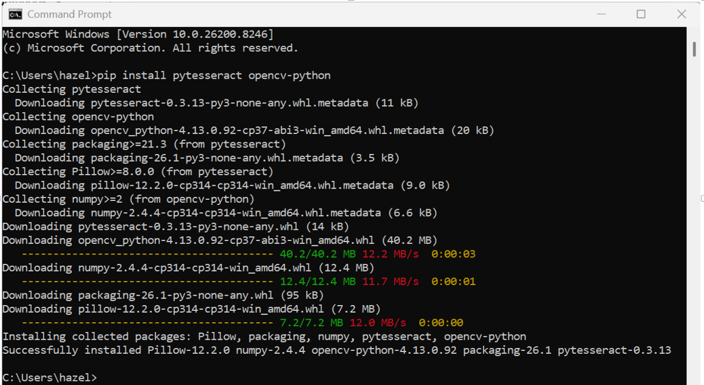
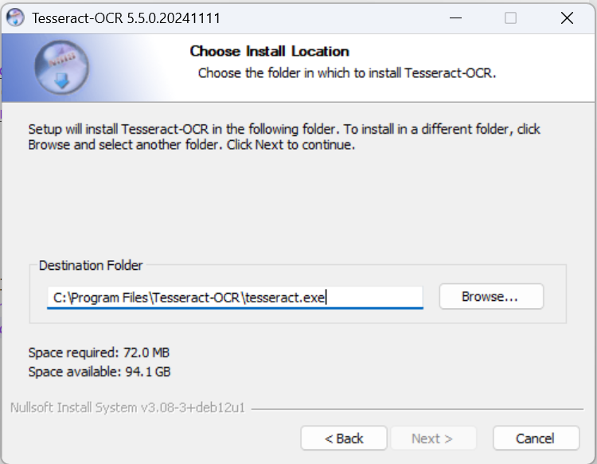
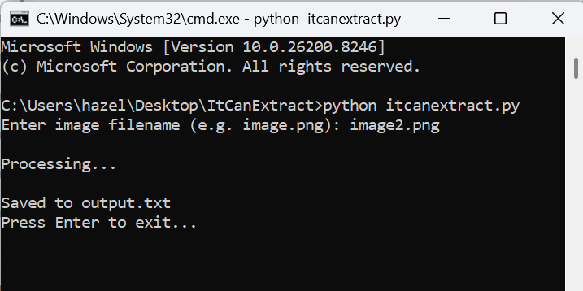
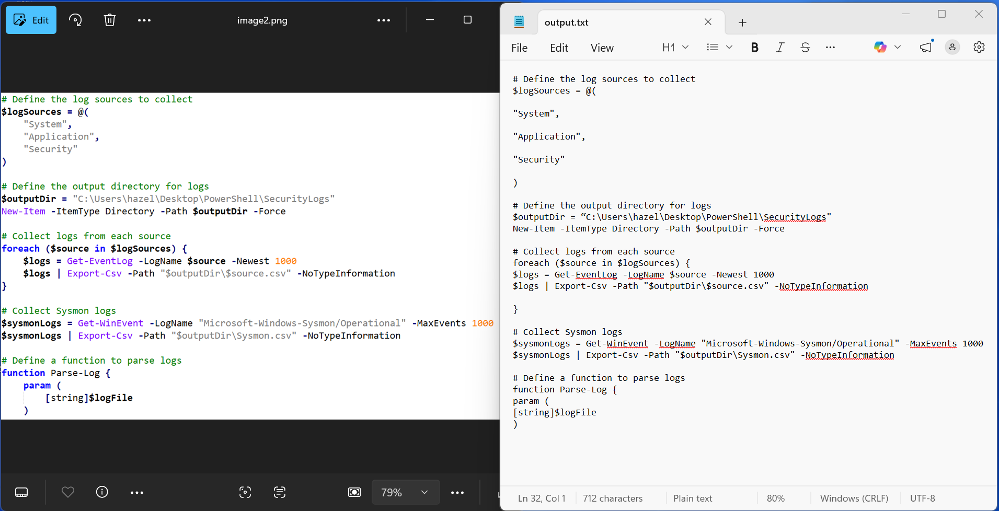

# ItCanExtract - Simple OCR Tool

ItCanExtract is a beginner-friendly Win64 offline OCR tool that extracts text from images using Tesseract.

---

## Features

* Extracts text from PNG, JPG, JPEG images
* Saves output automatically to `output.txt` file
* Simple command-line interface
* Beginner-friendly execution using batch file

---

## Limitations

* Not 100% accurate
* Image quality affects results
* Code indentation may not be preserved
* Not suitable for handwritten text

---

## Download dependencies

1. Download Python: https://www.python.org/downloads/windows/
2. Download tesseract-ocr for Win64 (tesseract-ocr-w64-setup-5.5.0.20241111.exe): https://github.com/UB-Mannheim/tesseract/wiki

---

## Python Dependencies Explained

This project uses a few required Python libraries. These are listed in the `requirements.txt` file.

### What is `requirements.txt`?

`requirements.txt` is a standard file used in Python projects to list all required libraries needed for the tool to run properly.

---

### What each dependency does:

* **pytesseract**
  - A Python wrapper that allows this tool to communicate with the Tesseract OCR engine.

* **opencv-python**
  - Used for image processing (loading images, converting formats, improving OCR accuracy).

* **Pillow**
  - A lightweight image library used for handling and preparing image data.

---

## Installation

1. Install Python 

2. Install tesseract-ocr: pip install pytesseract opencv-python
	
	
2.1. Set Tesseract-OCR install location's destination folder to: 
	"C:\Program Files\Tesseract-OCR\tesseract.exe"

---

## Usage

How To Use ItCanExtract:

Option 1: Double click run.bat (automated)

Then enter the image filename when prompted.

Option 2: Run itcanextract.py script in the cmd using the command:

python itcanextract.py

Then enter the image filename (e.g. image.png).

---Extracted Output---

---

## Execution Preview

[View Execution Video](resources/itcanextract_usage_mp4_preview.mp4)

---

## Disclaimer

This tool is intended for general-purpose text extraction from images using optical character recognition (OCR) techniques.

While efforts have been made to ensure reliable functionality, OCR results may vary depending on factors such as image quality, resolution, formatting, and content complexity. As such, extracted text should be reviewed and validated before being used in any critical, legal, or decision-making context.

This software is provided for educational and productivity purposes only. The author makes no guarantees regarding accuracy, completeness, or fitness for a particular purpose, and assumes no liability for any direct or indirect consequences arising from its use.

Users are responsible for ensuring that their use of this tool complies with applicable laws, regulations, and organizational policies.

---

## AI Acknowledgment

This tool was developed with the assistance of ChatGPT.
